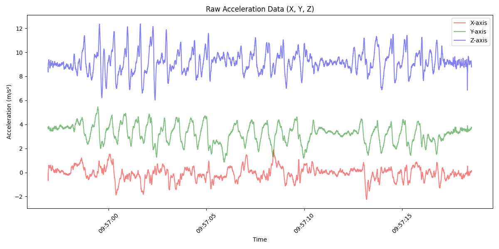
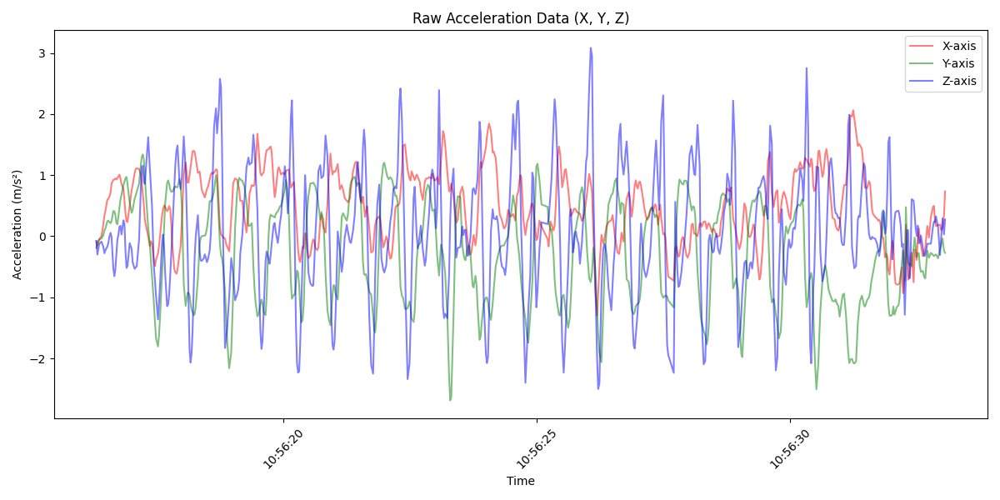
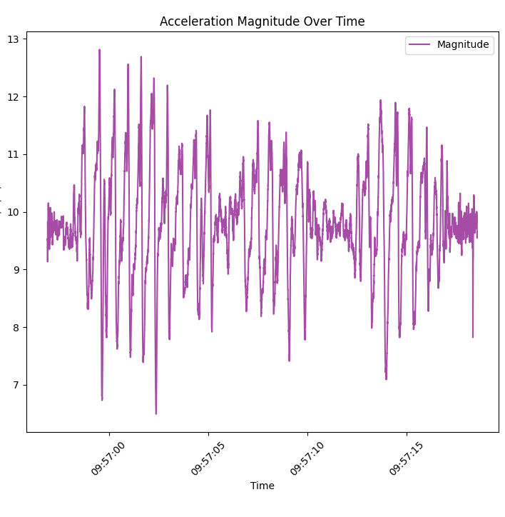
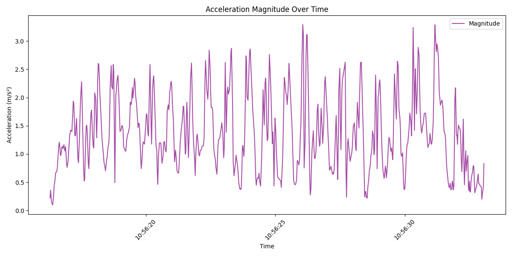
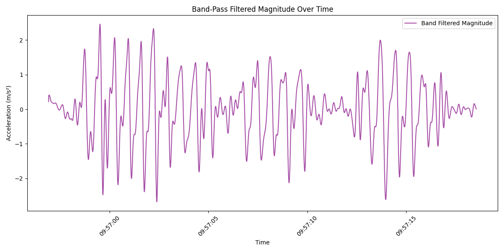
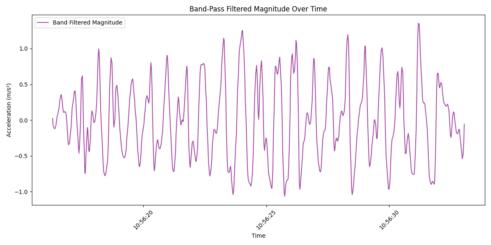
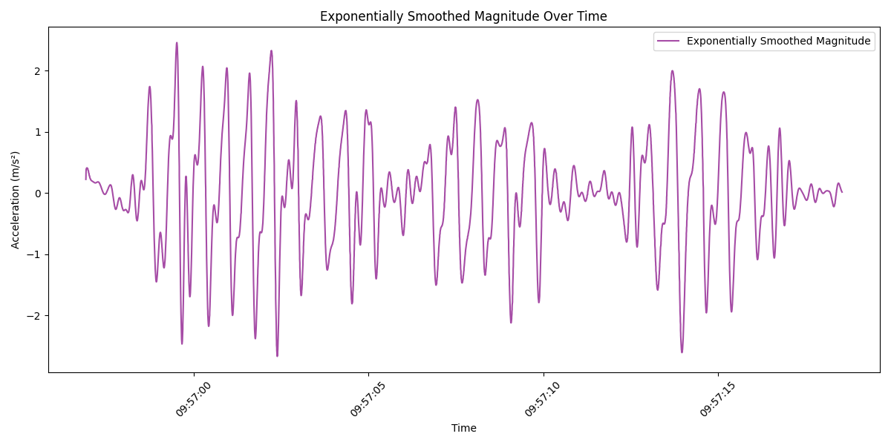
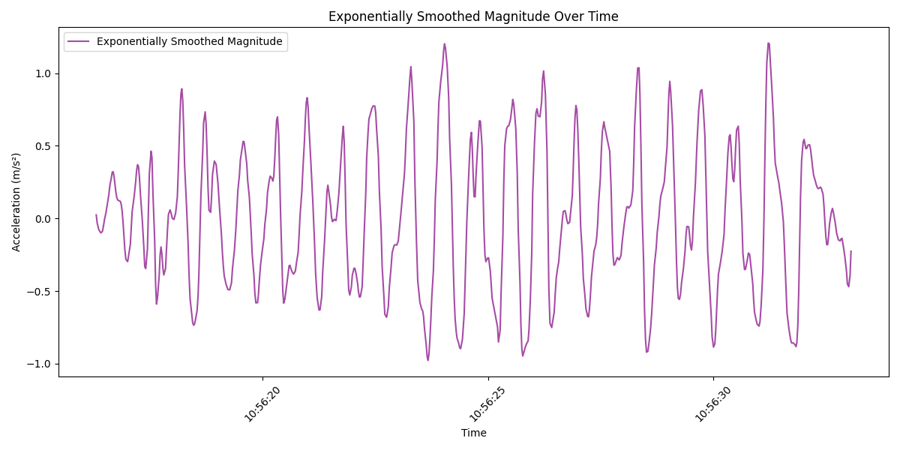
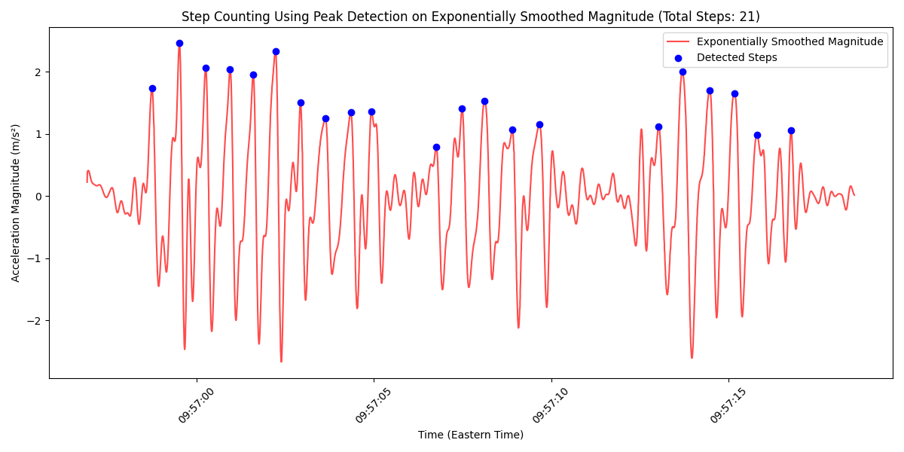
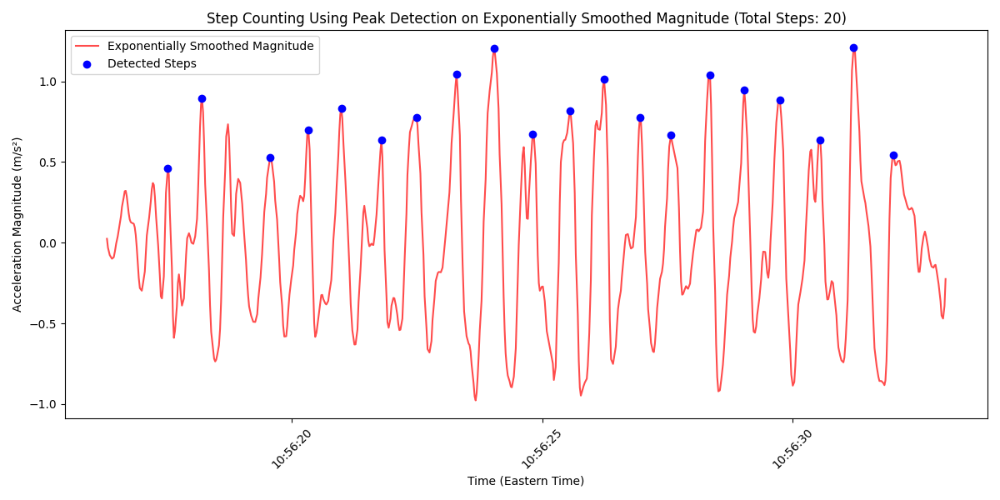

# Lab 2 Part 1 Writeup 

The code for this portion of the lab is implemented in lab2part1.py, which is located in the same directory as this file. This code has comments to help understanding of the overall flow along with the purpose of helper functions in the high-level step counting algorithm. Each part below contains relevant code snippets related to the task, but they are also organized and labeled in the source code for viewing there. 

## Task 1: Visualizing acceleration data

### 1. Plotting code

def visualize_xyz_data(data):

    """

    Visualize the x, y, z acceleration data.

    """

    plt.figure(figsize=(12, 6))

    plt.plot(data['timestamp'], data['x'], 

    label='X-axis', color='red', alpha=0.5)
    
    plt.plot(data['timestamp'], data['y'], label='Y-axis', color='green', alpha=0.5)

    plt.plot(data['timestamp'], data['z'], label='Z-axis', color='blue', alpha=0.5)

    plt.xlabel('Time')

    plt.ylabel('Acceleration (m/s²)')

    plt.title('Raw Acceleration Data (X, Y, Z)')

    plt.xticks(rotation=45)

    plt.legend()

    plt.tight_layout()

    plt.show()

### 2. Plots 

`data/D1_lefthand_normal_20steps.csv`

`data/D3_righthand_normal_20steps_linearaccelerometer.csv`

### 3. Questions

## Task 2: Visualize the magnitude of acceleration

### 1. Plots 

`data/D1_lefthand_normal_20steps.csv`

`data/D3_righthand_normal_20steps_linearaccelerometer.csv`

### 2. Questions

## Task 3: Denoising the magnitude data

### 1. Bandpass filter code

def band_pass_butterworth_filter(data, low_cutoff, high_cutoff, sampling_rate, order=4):

    """

    Apply a band-pass Butterworth filter to remove frequencies below and above specified cutoffs.

    """

    nyquist = 0.5 * sampling_rate

    low = low_cutoff / nyquist

    high = high_cutoff / nyquist

    b, a = butter(order, [low, high], btype='band', analog=False)

    y = filtfilt(b, a, data)

    return y

def apply_band_pass_filter(data, sampling_rate, low_cutoff=0.5, high_cutoff=5.0):

    """

    Apply band-pass filter to the magnitude of the acceleration data.

    """

    data['magnitude_band_filtered'] = band_pass_butterworth_filter(data['magnitude'], low_cutoff, high_cutoff, sampling_rate)

    visualize_data(data['timestamp'], data['magnitude_band_filtered'], 'Band Filtered Magnitude', 'Band-Pass Filtered Magnitude Over Time')

    return data

### 2. Plots 

`data/D1_lefthand_normal_20steps.csv`

`data/D3_righthand_normal_20steps_linearaccelerometer.csv`

### 3. Exponential moving average code

def apply_exponential_smoothing(data, alpha=0.5):

    """

    Apply exponential smoothing to reduce noise.

    """

    data['magnitude_smoothed'] = data['magnitude_band_filtered'].ewm(alpha=alpha).mean()

    visualize_data(data['timestamp'], data['magnitude_smoothed'], 'Exponentially Smoothed Magnitude', 'Exponentially Smoothed Magnitude Over Time')
    
    return data

### 4. Plots 

`data/D1_lefthand_normal_20steps.csv`

`data/D3_righthand_normal_20steps_linearaccelerometer.csv`

## Task 4: Step counting on filtered magnitude data

### 1. Step counts

__D1 Steps Detected:__ 21 

__D3 Steps Detected:__ 20

### 2. Plots 

`data/D1_lefthand_normal_20steps.csv`

`data/D3_righthand_normal_20steps_linearaccelerometer.csv`

### 3. Step count tables

Total Step Count: 20

        ID      Actual    Detected     Passed?

         1          20          21        True

         2          20          21        True

         3          20          20        True

         4          20          21        True

         5          20          20        True